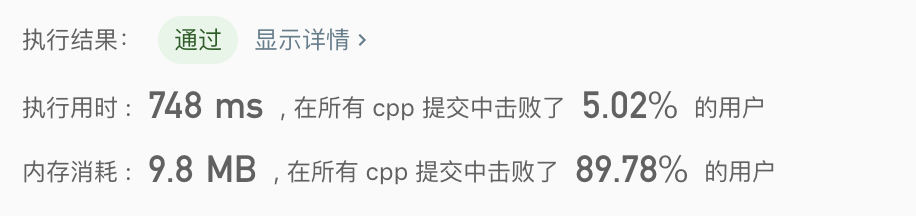

# LeetCode_29 题解
## 题目描述
在一个有序的数组中去除，详细见题目[链接](https://leetcode-cn.com/problems/remove-duplicates-from-sorted-array/)。
## 解题思路
1. 首先最容易想到用set可以去重，所以把所有元素扔进set即可(但是题目说了不要用到额外的存储空间所以不可用)。
2. 使用暴力求解一旦遇到重复的就删除。
3. 本题题目上说了给出的用例是有序的所以可以对方法2进行修改，使用双指针的方法简化遍历删除的过程。
## 解题代码
### 方法1暴力遍历
####算法代码
```c
class Solution {
public:
    int removeDuplicates(vector<int>& nums) {
        //遍历
        for (int i = 0 ; i < nums.size(); i ++){
            for (int j = i+1; j < nums.size() ; j ++){
                if (nums[i] == nums[j]){
                    nums.erase(nums.begin()+j);
                    j = j-1;
                }
            }
        }
        return nums.size();
    }
};
```
####方法分析
直接使用了两层遍历遍历了所有元素，相同就删除，这种方法在元素乱序的时候也能够使用。
- 时间复杂度：O(n^2)
- 空间复杂度：O(1)

### 方法2双指针
####算法代码
```c
class Solution {
public:
    int removeDuplicates(vector<int>& nums) {
        //空数组判断
        if(nums.size()==0)
            return 0;
        //index来存储头当前最入的数字所处于的位子
        int head = 0;
        for (int i = head ; i < nums.size(); i ++){
            //找到第一个与index不相同的位置
            //把这个数字存在++head中的位子
            if(nums[i]!=nums[head]){
                nums[++head]=nums[i];
            }
        }
        //数组只有在下表0-head之间才是没有重复的元素把后续的元素删除
        nums.erase(nums.begin()+head+1,nums.begin()+nums.size());
        return nums.size();
    }
};
```
####方法分析
应为遍历是有序的我们只需要把每次监测到的与上一个元素不同的元素存在头指针的位置，用一个i来遍历数组，用一个head来表示当前存储下个不一样元素的指针位置，只用依次遍历即可。
- 时间复杂度：O(n)
- 空间复杂度：O(1)

