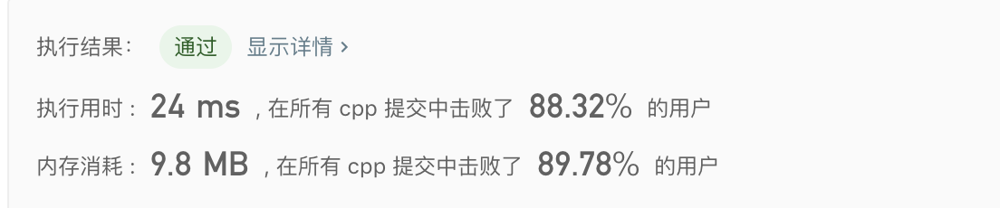

# LeetCode_641 题解
## 题目描述
设计一份循环双端队列，详细见题目[链接](https://leetcode-cn.com/problems/design-circular-deque/)。
## 解题思路
- 本题设计一个循环双端队列，主要实现插入删除操作所以适合用链表实现。
- 当然本题也可以使用数组的方式实现
## 解题代码
### 方法1链表实现
#### 算法代码
```c
class MyCircularDeque {

private:
    //定义节点
    typedef  struct Node{
        int value;
        Node *next;
        Node *pre;
    }node;
    //定义双端队列结构
    node * head;
    node * tail;
    int len; // 用来
    int count;//用来存储总容量

public:

    /** Initial}ize your data structure here. Set the size of the deque to be k. */
    MyCircularDeque(int k) {
        count = k;
        head = NULL;
        tail = NULL;
        len = 0;
    }

    /** Adds an item at the front of Deque. Return true if the operation is successful. */
    bool insertFront(int value) {
        if(isFull())
            return false;
        if(isEmpty()){
            head = new node;
            head->next = head;
            head->pre = head;
            tail = head;
            head->value = value;
        }else{
            node *p = new node;
            p->value = value;
            p->next = head;
            p->pre = tail;
            head->pre = p;
            tail->next = p;
            head = p;
        }
        len++;
        return true;
    }

    /** Adds an item at the rear of Deque. Return true if the operation is successful. */
    bool insertLast(int value) {
        if(isFull())
            return false;
        if(isEmpty()){
            head = new node;
            head->next = head;
            head->pre = head;
            tail = head;
            head->value = value;
        }else{
            node *p = new node;
            p->value = value;
            p->next = head;
            p->pre = tail;
            head->pre = p;
            tail->next = p;
            tail = p;
        }
        len++;
        return true;

    }

    /** Deletes an item from the front of Deque. Return true if the operation is successful. */
    bool deleteFront() {
        if(isEmpty())
            return false;
        len = len-1;

        head->next->pre=tail;
        tail->next = head->next;
        // free(head);
        head = tail->next;

        return true;
    }

    /** Deletes an item from the rear of Deque. Return true if the operation is successful. */
    bool deleteLast() {
        if(isEmpty())
            return false;
        len = len-1;

        tail->pre->next = head;
        head->pre = tail->pre;
        // free(tail);
        tail = head->pre;

        return true;
    }

    /** Get the front item from the deque. */
    int getFront() {
        if(isEmpty())
            return -1;
        return head->value;
    }

    /** Get the last item from the deque. */
    int getRear() {
        if(isEmpty())
            return -1;
        return tail->value;
    }

    /** Checks whether the circular deque is empty or not. */
    bool isEmpty() {
        if(len==0)
            return true;
        else
            return false;

    }

    /** Checks whether the circular deque is full or not. */
    bool isFull() {
        if(len == count)
            return true;
        else
            return false;
    }


}
```
### 算法分析
- 插入操作：不管是从头插入还是尾部插入，由于是循环队列，其实始终都是在同一个地方不同的是在尾部插入要修改插入节点为尾(tail),如果是头插入则该节点修改为头(head)
- 删除操作：首先修改前后对应的指针然后free掉该节点即可
- empty：是否为空只需要在双端队列中加入一个记录节点个数的变量直接判断即可
- isFull: 判断是否len==count，是否已经到达了容量上限。

